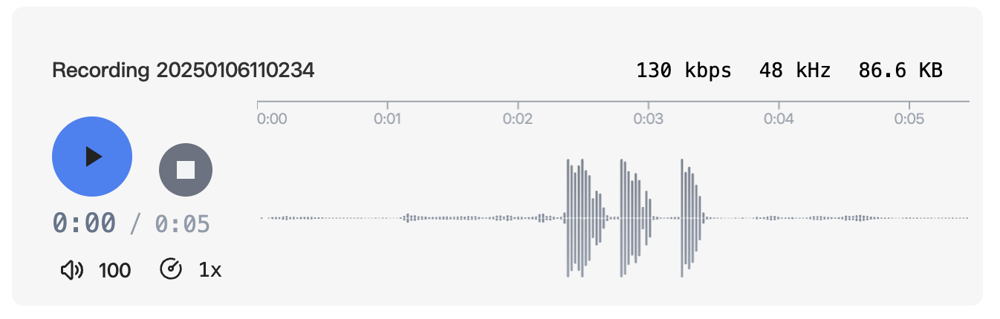

# Waveform Audio Player Plugin

A plugin that enhances the display of audio files in Obsidian, supporting both audio attachments and recorded audio files.

## Features

- Beautiful audio player interface
- Support for audio attachments (MP3, WAV, etc.)
- Support for Obsidian recorded audio

## Preview

### Before

### After

## Installation

### From Obsidian Community Plugins
1. Open Obsidian Settings
2. Go to `Community Plugins`
3. Disable `Safe Mode`
4. Search for "Audio Beautifier"
5. Click Install
6. Enable the plugin

## Usage

Once installed, the plugin automatically enhances the appearance of all audio files in your vault. No additional configuration needed.

## My Other Obsidian Plugins

* [Export Image](https://github.com/zhouhua/obsidian-export-image)
* [Markdown Media Card](https://github.com/zhouhua/obsidian-markdown-media-card)
* [vConsole](https://github.com/zhouhua/obsidian-vconsole)
* [POWER MODE](https://github.com/zhouhua/obsidian-power-mode)
* [PopKit](https://github.com/zhouhua/obsidian-popkit)
* [Another Sticky Headings](https://github.com/zhouhua/obsidian-sticky-headings)
